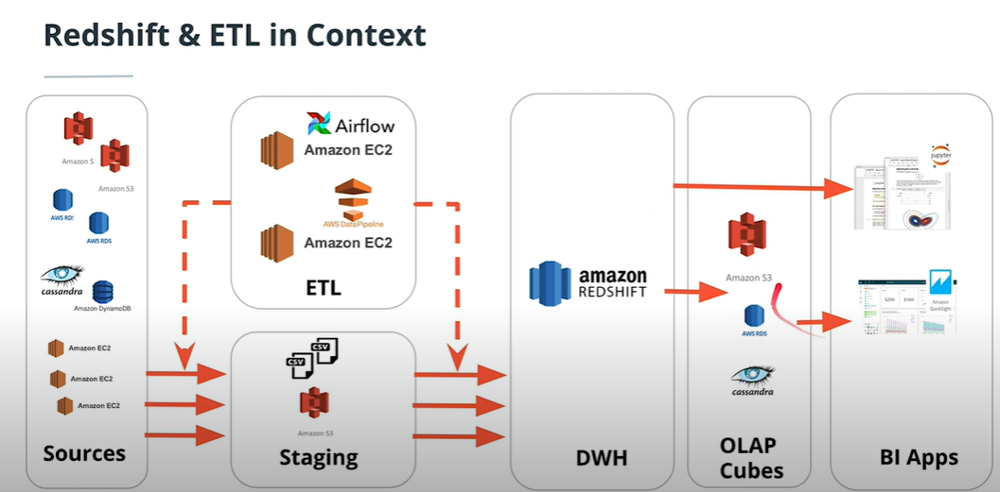

## Choices for implementing Data Warehouse:
---
1. On-Premise
    * Need for diverse IT skills & multiple locations
    * Cost of ownership (capital and operational costs)

2. Cloud
    * Lower barriers to entry (time and money)
    * Scalability and elasticity out of the box
    * Within cloud, there are 2 ways to manage infrastructure
        1. Cloud-Managed (Amazon RDS, Amazon DynamoDB, Amazon S3)
           * Reuse of expertise (Infrastructure as Code)
           * Less operational expense
        2. Self-Managed (EC2 + Postgres, EC2 + Cassandra, EC2 + Unix FS)

## Amazon Redshift
---
1. Properties
    * Column-oriented storage, internally it is modified Postgresql
    * Best suited for storing OLAP workloads
    * is a Massively Parellel Processing Database
        * Parallelizes one query on multiple CPUS/machines
        * A table is partitioned and partitions are processed in parallel

2. Architecture
    * Leader Node:
        * Coordinates compute nodes
        * Handles external communication
        * Optimizes query execution
    * Compute Node:
        * Each with CPU, memory, disk and a number of slices
            * A node with n slices can process n partitions of a table simultaneously
        * Scale-up: get more powerful nodes
        * Scale-out: get more nodes
    * Example of setting up a Data Warehouse in Redshift:
    
    Source: Udacity DE ND Lesson 3: Implementing Data Warehouses on AWS

3. Ingesting at Scale
    * Use COPY command to transfer from S3 staging area
    * If the file is large, better to break it up into multiple files
        * Either use a common prefix or a manifest file
    * Ingest from the same AWS region
    * Compress all csv files

4. Optimizing Table Design
    * 2 possible strategies: distribution style and sorting key

    1. Distribution style
        * Even:
            * Round-robin over all slices for load-balancing
            * High cost of joining (Shuffling)
        * All:
            * Small (dimension) tables can be replicated on all slices to speed up joins
        * Auto: 
            * Leave decision with Redshift, "small enough" tables are distributed with an ALL strategy. Large tables distributed with EVEN strategy
        * KEY:
            * Rows with similar values of key column are placed in the same slice
            * Can lead to skewed distribution if some values of dist key are more frequent than others
            * Very useful for large dimension tables
    
    2. Sorting key
        * Rows are sorted before distribution to slices
        * Minimize query time since each node already has contiguous ranges of rows based on sorting key
        * Useful for colummns that are frequently in sorting like date dimension and its corresponding foreign key in fact table

