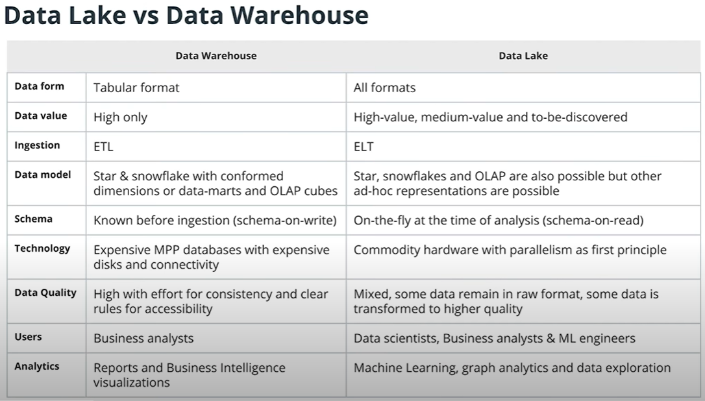

## What is a Data Lake?
---
* A data lake is a system or repository of data stored in its natural/raw format, usually object blobs or files (from Wikipedia). 

## Why Data Lakes?
---
* Some data is difficult to put in tabular format, like deep json structures.
* Text/Image data can be stored as blobs of data, and extracted easily for analytics later on.
* Analytics such as machine learning and natural language processing may require accessing raw data in forms totally different from a star schema.

## Difference between Data Lake and Data Warehouse
---

Source: Udacity DE ND

* A data warehouse is like a producer of water, where users are handled bottled water in a particular size and shape of the bottle.
* A data lake is like a water lake with many streams flowing into it and its up to users to get the water the way he/she wants

## Data Lake Issues
---
* Data Lake is prone to being a "chaotic garbage dump".
* Since a data lake is widely accessible across business departments, sometimes data governance is difficult to implement
* It is still unclear, per given case, whether a data lake should replace, offload or work in parallel with a data warehouse or data marts. In all cases, dimensional modelling, even in the context of a data lake, continue to remain a valuable practice.
* Data Lake remains an important complement to a Data Warehouse in many businesses.
