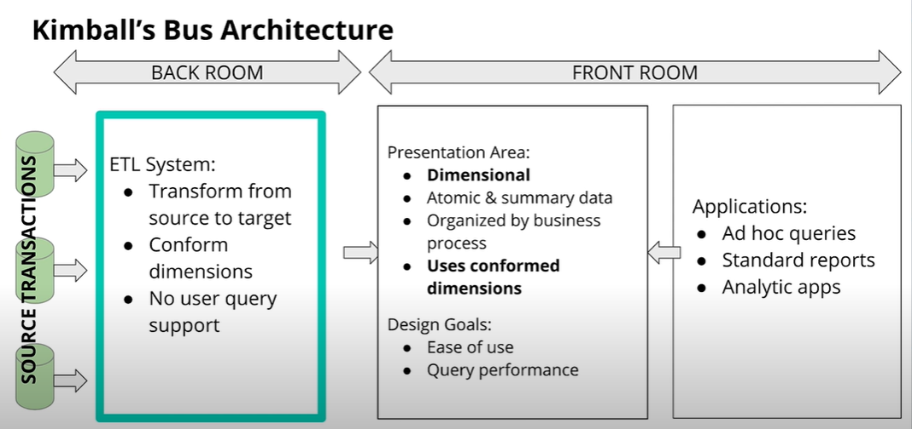
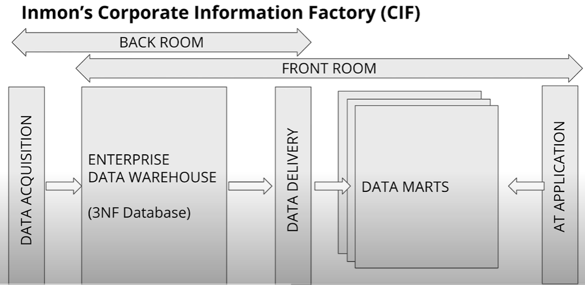

## What is a Data Warehouse?
---
* Data Warehouse is a system (including processes, technologies & data representations that enables support for analytical processing)

* Goals of a Data Warehouse:
    * Simple to understand
    * Performant
    * Quality Assured
    * Handles new business questions well
    * Secure

## Architecture
---
* Several possible architectures to building a Data Warehouse
1. **Kimball's Bus Architecture**:

    * Results in common dimension data models shared by different business departments
    * Data is not kept at an aggregated level, rather they are at the atomic level
    * Organized by business processes, used by different departments 
2. **Independent Data Marts**:

    * Independent Data Marts have ETL processes that are designed by specific business departments to meet their analytical needs
    * Different fact tables for the same events, no conformed dimensions
    * Uncoordinated efforts can lead to inconsistent views
    * Generally discouraged
3. **Inmon's Corporate Information Factory**:

    * The Enterprise Data Warehouse provides a normalized data architecture before individual departments build on it
    * 2 ETL Process
        * Source systems -> 3NF DB
        * 3NF DB -> Departmental Data Marts
    * The Data Marts use a source 3NF model (single integrated source of truth) and add denormalization based on department needs
    * Data marts dimensionally modelled & unlike Kimball's dimensional models, they are mostly aggregated
4. **Hybrid Kimball Bus & Inmon CIF**:

## OLAP Cubes
---
* An OLAP Cube is an aggregation of a fact metric on a number of dimensions

* OLAP cubes need to store the finest grain of data in case drill-down is needed

* Operations:
1. Roll-up & Drill-Down
    * Roll-Up: eg, from sales at city level, sum up sales of each city by country
    * Drill-Down: eg, decompose the sales of each city into smaller districts
2. Slice & Dice
    * Slice: Reduce N dimensions to N-1 dimensions by restricting one dimension to a single value
    * Dice: Same dimensions but computing a sub-cube by restricting some of the values of the dimensions
    Eg month in ['Feb', 'Mar'] and movie in ['Avatar', 'Batman']

* Query Optimization
    * Business users typically want to slice, dice, rollup and drill-down
    * Each sub-combination goes through all the facts table
    * Using CUBE operation "GROUP by CUBE" and saving the output is usually enough to answer forthcoming aggregations from business users without having to process the whole facts table again

* Serving OLAP Cubes
    * Approach 1: Pre-aggregate the OLAP cubes and save them on a special purpose non-relational database (MOLAP)
    * Approach 2: Compute the OLAP Cubes on the fly from existing relational databases where the dimensional model resides (ROLAP)